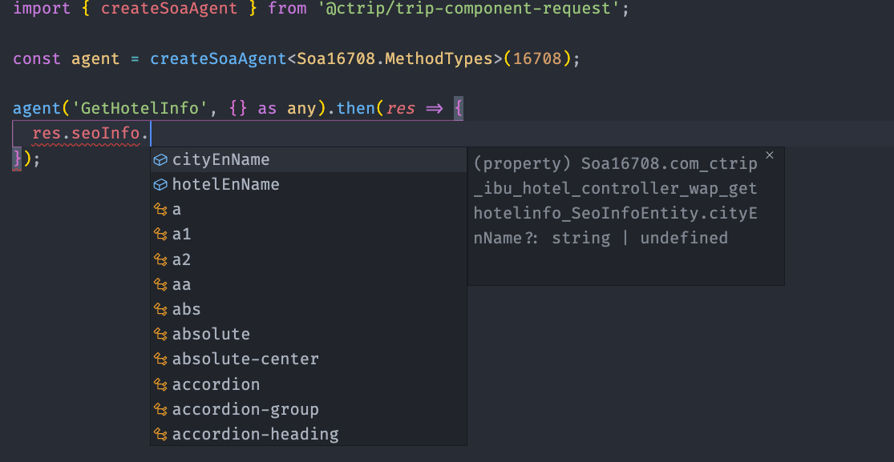

# Trip Component Request

## install

`npm install @ctrip/trip-component-request --registry http://registry.npm.release.ctripcorp.com`

## usage

### request

```ts
import { request } from '@ctrip/trip-component-request';

const promise = request(
  method: 'POST',
  ur: '<your api url>',
).then(response => {
  // do something
}).catch(err => {
  // do something
});

// abort request
promise.abort();
```

options

```ts
interface RequestOptions {
  // 请求地址
  url: string;
  // 请求方法
  method?: 'GET' | 'POST' | 'PUT' | 'DELETE' | 'OPTIONS';
  // 提交数据
  data?: any;
  // http request header 'Context-Type'
  contentType?: string;
  // 返回数据类型
  dataType?: 'script' | 'json' | 'document' | 'text' | 'arraybuffer' | 'blob';
  // 请求超时时间，单位：ms
  timeout?: number;
  // 自定义请求头
  headers?: {
    [key: string]: string;
  };
  // url search query
  params?: {
    [key: string]: any;
  };
  // 上报数据到 ubt, default: true;
  trackError?: boolean;
  // 是否缓存请求的 promise
  cache?: boolean | CacheOptions;
  transformResponse?: (responseData: any, response: { headers: Record<string, string> }) => any;
}
```

### jsonp

jsonp only support in browser env, not support in node.

```ts
import { jsonp } from '@ctrip/trip-component-request';

jsonp('<target-url>', { param1: value1 }[, JsonpOptions])
  .then(response => {
    // do something;
  })
  .catch(err => {
    // do something;
  });

interface JsonpOptions {
  // callback name in window object, default: 'callback'
  callbackKey?: string;
  // if true request will send by ajax, if false request will send by "script" tag. default: false
  useAjax?: boolean;
  // max time
  timeout?: number;
}
```

### createSoaAgent

```ts
import { createSoaAgent } from '@ctrip/trip-component-request';

const soaAgent = createSoaAgent('your-soa-service-code');

soaAgent('soa-method', {})
  .then(response => {
    // do something;
  })
  .catch(err => {
    // do something;
  });

// example for 13496
const soaOnlineCommonAgent = createSoaAgent(13496, {
  // soa method request args usually include "Head" property, store common info, like: locale, currency, etc.
  // "headKey" and "getHead" is useful for this, it will add `Head` to each request object.
  headKey: 'head',
  getHead() {
    const head = {
      group: 'trip',
    };
    return head;
  },
});

soaAgent('getCommonHtml', { htmlTemplatesType: 'PublicHead' })
  .then(response => {
    // do something;
  })
  .catch(err => {
    // do something;
  });
```

`Api:`

```ts
function createSoaAgent(serviceCode: string | number, opt: CreateSoaAgentOption): SoaAgent;

interface CreateSoaAgentOption {
  // default: null
  headKey?: string | null;
  // callback, function return will add to request body
  getHead?: (data?: any) => any;
  // get soa request url, useful for site proxy soa request.
  getRequestURL?: (serviceCode: string | number, method: string) => string;
  // use ip direct connect remote soa server，only useful in node.
  useDirectConnection?: boolean;
  invalidResponse?(
    response: SoaResponse<{}>,
    method: string,
    params: any,
    opt?: SoaAgentInvokeOptions,
  ): undefined | void | never; // callback when invoke success
}

// createSoaAgent method return a SoaAgent
interface SoaAgent {
  (method: string, params: any, opt?: SoaAgentInvokeOptions): Promise<any>;
}

interface SoaAgentInvokeOptions {
  query?: QueryObject; // search query
  timeout?: number;
  // custom http headers
  headers?: Record<string, string>;
  // if set "headKey" and "getHead", this head will merge to "getHead()" return object.
  head?: Record<string, any>;
  // use ip direct connect remote soa server，only useful in node.
  useDirectConnection?: boolean;
  // response data include response headers, property is: `SOA.ResponseHeaders`
  responseIncludeHeaders?: boolean;
}
```

### utils

```ts
/**
 * cover object to search query
 * @param ignoreNill ignore null or undefined value
 */
function buildQuery(query: object, ignoreNill = false);

/**
 * cover search query to object
 * @param query
 * @param overrideSameKey if true, when have same key, new value will override old value,
 *                        if false, value will became array
 * @example parseQuery('id=1&id=2', false) => { id: [1, 2] }
 */
function parseQuery(query: string, overrideSameKey: true): Record<string | number, string>;
function parseQuery(query: string, overrideSameKey: false): Record<string | number, string | string[]>;

/**
 * return new promise, if origin promise not resolve in time, throw reject;
 * @param time max time
 * @param promise promise
 */
function promiseTimeout<T>(time: number, promise: Promise<T>): Promise<T>;
```

## Typescript Support

if soa service register in [Soa Portal](http://gov.soa.fx.ctripcorp.com/), you can use [@ctrip/soa-type](http://npm.release.ctripcorp.com/package/@ctrip/soa-type) package to generate type declare files.

### example




see: [gitlab](http://git.dev.sh.ctripcorp.com/trip-component/trip-component-framework/tree/master/packages/trip-component-request/examples/soa)

## Ajax Performance Track

### Usage

install: `npm install @ctrip/trip-component-request --registry=http://registry.npm.release.ctripcorp.com`

#### use `@ctrip/trip-component-request` package for ajax request

`@ctrip/trip-component-request` export `request` and `createSoaAgent` method include ajax metric, you can use directly.

```ts
import { request, createSoaAgent } from '@ctrip/trip-component-request';

function callMyApi() {
  request
    .post('url', {})
    .then(() => {
      // do something
    })
    .catch(() => {
      // do something
    });
}

function callMySoa() {
  createSoaAgent(serviceCode)(method, {})
    .then(() => {
      // do something
    })
    .catch(() => {
      // do something
    });
}
```

#### use custom library for ajax request

```ts
// axios example
import axios from 'axios';
import { trackAjaxFail, trackAjaxSuccess } from '@ctrip/trip-component-request';

axios
  .post(url, {})
  .then(res => {
    trackAjaxSuccess(res.data, { url, responseHeaders: res.headers });
    // do other thing
  })
  .catch(err => {
    trackAjaxFail(err, { url });
    // do other thing
  });
```

```ts
// xhr example
import { trackAjaxFail, trackAjaxSuccess } from '@ctrip/trip-component-request';

function myAjax(url) {
  const xhr = new XMLHttpRequest();

  xhr.onreadystatechange = () => {
    // xhr done
    if (xhr.readyState === 4) {
      const response = decodeXHRResponse(xhr);
      trackAjaxSuccess(response, { url }, xhr);
      // do other thing
    }
  };

  xhr.addEventListener('error', err => {
    trackAjaxFail(err, { url }, xhr);
    // do other thing
  });

  xhr.open('POST', url, true, null, null);
  xhr.send({});
}
```

### metric && 自行埋点

埋点通过 ubt metric，参考 ubt 文档: [http://docs.ubt.ctripcorp.com/books/ubt-manual/dev-guide/js/api](http://docs.ubt.ctripcorp.com/books/ubt-manual/dev-guide/js/api)

metric key: `ibu_ajax_perf`

```ts
const ajaxMetric = {
  name: 'ibu_ajax_perf',
  value: xxxxx, // 请求的耗时（从 DNS 请求开始到接受到所有返回的数据）
  sample: 1-100,  // 默认全部采集
  tag: {
    // ajax request url
    url: string;
    duration: number,
    // ajax server locate region, h5 gateway will return this info in header "x-gate-region";
    region: string,
    // 数据集合
    data: `{
      // dns 查找的耗时
      DNSTime: number,
      // tcp 连接的耗时
      TCPTime: number,
      // ssl 连接的耗时
      SSLTime: number,
      // 发出请求到接受到第一个字节的耗时
      requestTime: number,
      // 接收到第一个字节到全部接收的耗时
      responseTime: number,
      // 整个 ajax 请求的耗时
    }`,
  },
};

window.__bfi.push(['_trackMetric', metric]);
```

### 原理

时间的采集基于浏览器的 `Resource Timing API`

region 从 `Response Header` 里的 `x-gate-region` 获取。


```ts
// get all browser resource entries
const entries = performance.getEntriesByType("resource");
// find target ajax entry by url
const targetEntry = findTargetEntryByUrl(entries, url);

function diff(end: number, start: number) {
  return start > 0 && end > start ? end - start : 0;
}

// 从 entry 获取到 time
// 仅做参考
const timing: AjaxPerformanceTiming = {
  DNSTime: diff(entry.domainLookupEnd, entry.domainLookupStart),
  TCPTime: diff(entry.connectEnd, entry.connectStart),
  SSLTime: diff(entry.connectEnd, entry.secureConnectionStart),
  requestTime: diff(
    entry.responseStart,
    entry.requestStart || entry.fetchStart || entry.startTime,
  ),
  responseTime: diff(entry.responseEnd, entry.responseStart),
  duration: entry.duration || diff(entry.responseEnd, entry.fetchStart),
};

const ajaxMetric = {
  name: 'ibu_ajax_perf',
  value: xxxxx, // 请求的耗时（从 DNS 请求开始到接受到所有返回的数据）
  sample: 1-100,  // 默认全部采集
  tag: {
    // ajax request url
    url: string;
    region: getRegionFromResponseHeader(),
    ...timing,
  },
};

// send data to ubt
window.__bfi.push(['_trackMetric', metric]);
```

参考：[MDN](https://developer.mozilla.org/zh-CN/docs/Web/API/Resource_Timing_API/Using_the_Resource_Timing_API)
